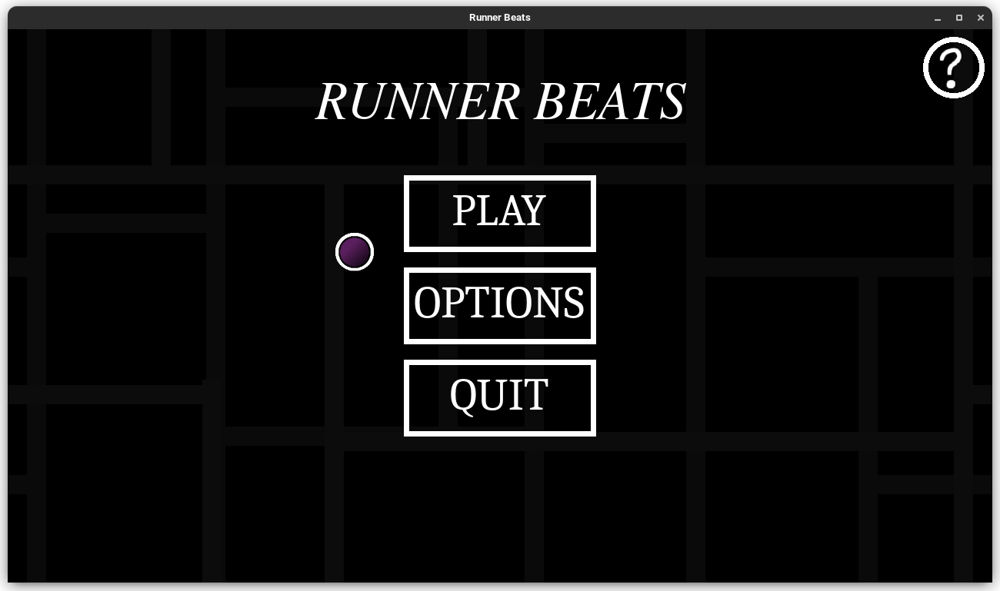
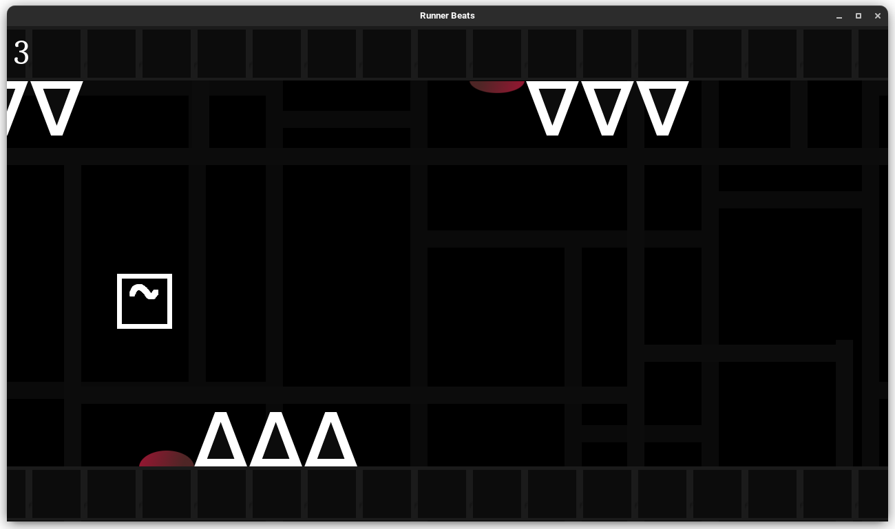

# MyRunner

## Warning
This projet has been made public in order to show my skills. Attention for EPITECH students for **-42**

## Description
My Runner is a project of the **Graphics module part one** of the first semester of first year at Epitech. The goal of the project is to re-create a game in C with the CSFML library using the gameplay of *Geometry Dash* and *T-Rex Game*. This project was completed in 4 weeks.



## Install and Run the project

### Requirements
> CSFML

To install and run the game. Please run the following commands in a terminal.

Clone repository:
```bash
$> git clone git@github.com:ZerLock/EPITECH-MyRunner.git
$> cd EPITECH-MyRunner
```

Compile the project
```bash
$> make re
```

Run the project
```bash
$> ./my_runner maps/*name_of_map*
```

## How to play
The object of the game is to reach the end of the level. To do this, you can change your character's gravity to avoid obstacles by pressing the **spacebar**



## Results
Note Review : **56/102**<br/>
Module Grade : **A**

## Maintener

- [Léo Dubosclard](https://github.com/ZerLock)
